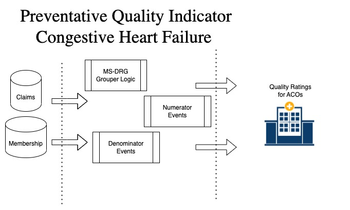

## Congestive Heart Failure Quality Metrics & MS-DRG as a SQL UDF 

Patient Risk and Quality are closely intertwined and as a follow up to [predicting patient risk](https://github.com/databricks-industry-solutions/hls-patient-risk), we then determine which organizations are best suited to treat at risk patients for Congestive Heart Failure (CHF). 

The measure developed is a value between 0 (good) and 1 (bad) for providers who treat patients with CHF. This measure is part of the Preventative Quality Indicators (PQIs) developed by the Agency for Healthcare Research and Quality (AHRQ).
___

___

## Getting started

### Measuring Quality with PQI Indicators 

PQI indicators are typically assigned to an Affordable Care Organization (ACO) and show an organiation's effectiveness at preventative treatments. For this measure we are determining which organizations have the best score (closest to 0) to treat Congestive Heart Failure. 

In the [notebook](./ahrq-chf-notebook) we show an example of calculating quality scores for ACOs using CMS claims data. 

### Calculating MS-DRGs from a UDF

MS-DRGs are primarily used to represent inpatient claim payments. The ability to transform many inpatient records into a simple representation has its uses in [assessing quality metrics](https://github.com/databricks-industry-solutions/CHF-care-quality/blob/main/ahrq-chf-notebook/chf-pqi-scoring.sql#L147) as well as for predictive modeling on complex events. 

We provide a [spark-udf](./ms-drg-udf) as a pre-built [jar](https://github.com/databricks-industry-solutions/CHF-care-quality/releases) that allows you to run this calculation directly on Databricks.

### Project support for CHF Quality Metric & MS-DRGs 

Please note the code in this project is provided for your exploration only, and are not formally supported by Databricks with Service Level Agreements (SLAs). They are provided AS-IS and we do not make any guarantees of any kind. Please do not submit a support ticket relating to any issues arising from the use of these projects. The source in this project is provided subject to the Databricks [License](./LICENSE). All included or referenced third party libraries are subject to the licenses set forth below.

Any issues discovered through the use of this project should be filed as GitHub Issues on the Repo. They will be reviewed as time permits, but there are no formal SLAs for support. 
