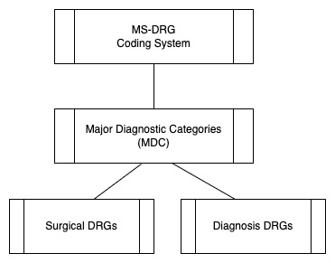

# Spark UDF of CMS DRG Grouper v39

MS-DRGs are a summarization of inpatient stay information into a simple 3 digit DRG Code. This is done through a defined set of rules set forth by CMS, and recently CMS has provided source Java code that implements these sets of rules. In addition to the DRG Code, a medical/surgical indicator as well as a major diagnostic category (MDC) code is produced by the grouper software. More information can be found on CMS's [website](https://www.cms.gov/medicare/medicare-fee-for-service-payment/acuteinpatientpps/ms-drg-classifications-and-software)



## Installing on Databricks

Attach the repo jar package to your Spark 3.3.0, scala 2.12 Databricks cluster runtime.

## Running on Databricks

### Input

8 fields are accepted as ordered paramters to the drg grouper. A none existant value should be passed as a blank string e.g. "". 

| Field # | Name | Description |
| -- | -- | -- |
| 1 | age | age of the patient at time of entry |
| 2 | sex | sex of the patient |
| 3 | length of stay | the number of days the patient stayed an in the inpatient setting |
| 4 | admit diagnosis code | The ICD10 diagnosis code of the admission |
| 5 | principal diagnosis code | The ICD10 diagnosis code primary for the stay | 
| 6 | hcfa discharge status code | The discharge status code of the patient | 
| 7 | other diagnosis codes (a list comma sepearted) | A string value of other ICD10 diagnosis codes listed as comma separated | 
| 8 | other procedure codes (a list comma seperated) | A string value of all procedure codes listed as comma separated |

### Execution on a dataset 

```scala
%scala 

//Register as a UDF
spark.sqlContext.udf.register("drgUDF", new com.databricks.labs.msdrg.DrgUDF().call _)

//1 record sample
val df = spark.sql(""" select drgUDF('0', 'M', '0', 'I120', 'I120', '1', 'E0800', '0TY00Z0,0FYG0Z0,5A1D70Z') as drg """)

df.show() 
/*Show DRG Output
  drg.drgCode -> 19 
  drg.drgDescription -> "Simultaneous pancreas and kidney transplant with hemodialysis"
  drg.mdcCode -> 11
  drg.mdcDescription -> "Diseases and disorders of the kidney and urinary tract"
  drg.medSurgType -> "SURGICAL"
  drg.grouperRC -> "OK"
*/

//Example of grouping inpatient claims together from a table
val df = spark.sql("""
 select inpatient_stay_id, 
  drgUDF(age, sex, length_of_stay, admit_dx_cd, principal_dx_cd, 
    hcfa_discharge_status_cd, 
    concat(collect_list(dx_cd), ','),
    concat(collect_list(proc_cd), ',')
   ) as drg_cd
 from <sample_table> 
 group by inpatient_stay_id, age, sex, length_of_stay, admit_dx_cd, principal_dx_cd, hcfa_discharge_status_cd
""")
```

### Sample DRG, MDC, and Medical/Surgical indicators

[Index by MDC](https://www.cms.gov/icd10m/version39-fullcode-cms/fullcode_cms/P0001.html)   
[Index by DRG](https://www.cms.gov/icd10m/version39-fullcode-cms/fullcode_cms/P0002.html)

